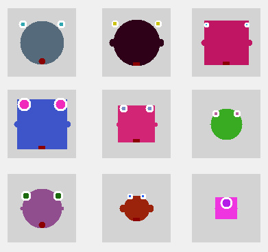
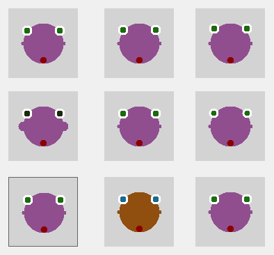
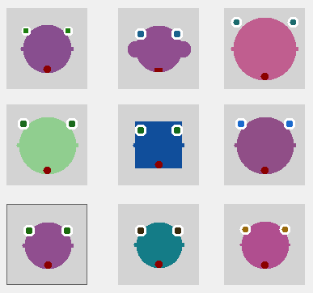

Evolutionary Faces Gui
----------------------

This is a C# project that illustrates how Genetic Algorithms (GA) can be used for agent shaping. In this case the agents are immaginary faces. 
Using GA it is possible to  find solutions to optimization problems. The algorithm recombines the population of possible solutions in order to find the best one. The candidate solution must be represented as an array of bits called *chromosome*. The GA  

At the beginning a random population of agents is generated, in this first step the agents look very different.
 

Generally a function called *fitness* is used in order to *select* the best individuals. In evoface there is not a fitness function because it is the user that select the best individual of the population. After the selection some kind of recombination operators can be applied to the single agent or to a group of agents. 

When you select a specific face the software take the agent's chromosome and mutate it. The resulting offsprings are a recombination of the original agent. When a mutation happens it switches a single bit inside the chromosome and it influences the appearence of the offspring.  If you select an agent the remaining windows will be fill with 8 offsprings

The mutation probability can be changed (the default value is 1.0%), higher the value higher the chromosome variability. For example, if you choose the same agent but you set an higher mutation probability (10.0%) the resulting offsprings will be more different than the parent.

Architecture
------------

There are two main classes in evoface: Chromosome and Agent. The Chromosome class is a generic and reusable class that use a list of bytes for generically representing a single solution to the problem. The Agent class uses the Chromosome to encapsulate the features associated to the agent, it permits to translate the chromosome to a face (genotype to phenotype).

Installation
------------

The repository provides a ready to use executable and the complete source code. The solution file can be opened with Visual Studio 2015, I did not tested it with older versions of VS. The project is self-contained and does not require any external library.

1. Clone the repository or download it [here](https://github.com/mpatacchiola/evoface/archive/master.zip)
2. Open the file `evoface.sln` with Visual Studio.
3. Compile the code and enjoy.

The repository provides also a pre-compiled version of the software in the folder *evoface/bin/Release*. The pre-compiled executable can be started also in Linux using Wine.
